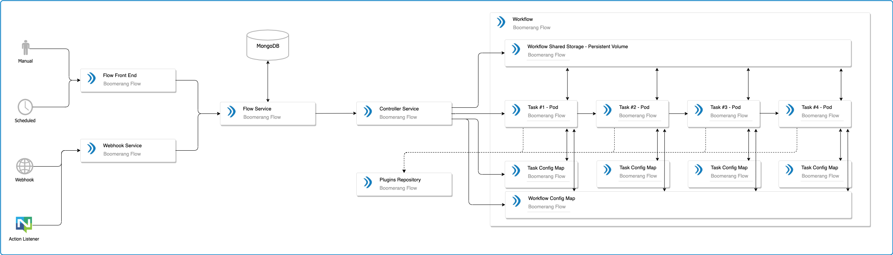

# Architecture Overview

The Boomerang Flow application has the following main components

1. Front End application - end user visual designer enabling no code workflow building and ability to see manage all aspects of your workflows including activity and insights.
2. Back End Microservice - translates the requests from the front end and other trigger interactions to an agnostic DAG model.
3. Kubernetes Controller - integrates with Kubernetes to perform and manage executions.
4. Task Workers - containers to execute the tasks mapped in the workflow

## Standard Tasks

Standard tasks are pre built tasks designed for a no code experience in Flow. They are single focus tasks that may offer tight integration into the platform. They have a guaranteed implementation and tested experience.

## Custom Tasks

The custom task is a slightly different implementation than the standard tasks that come out of the box with Flow. Where as the standard tasks have deep integration to the Flow and Controller services, the custom task has no knowledge or understanding of this, nor do we want to force teams to adhere to a specific implementation.

As such the custom task is essentially a bring your own container paradigm which Flow then wraps with its own lifecycle implementation via init-containers and sidecars.

The custom task is denoted by a flag in the upper left corner of the task in the designer and workflow run screens.

### Init Lifecycle

The Init Lifecycle is implemented as an init-container and ensures that the pre-start requirements are met. This includes creating a lock file and any other dependencies that are needed.

### Watcher Lifecycle

The watcher lifecycle is implemented as a sidecar container. This container waits for the custom container to complete and then executes the termination activities. This includes setting output properties for the custom task.

The Watcher and the Custom Task containers are linked through a kubernetes emptyDir mounted to the `/lifecycle` path.

### Controller

The Flow controller will orchestrate this lifeycle in conjunction with ensuring the normal critera.