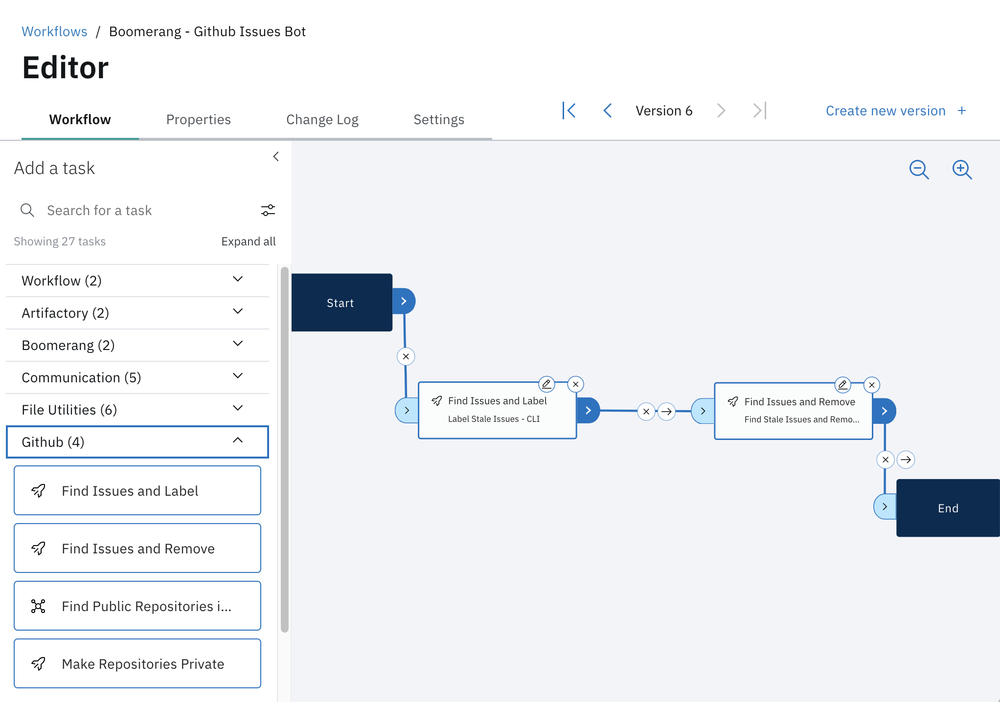

# GitHub Issues Bot

The following use cases describes how you can set up a GitHub Issues Bot using Boomerang Flow with no code. These bots are useful in finding, labeling, and closing stale issues after a period of inactivity.

> You will _need_ a GitHub Personal Access Token for this for a user that has access to the repository.

> You will _also need_ access to Boomerang Flow

## Create your Flow

First create your new workflow by navigating to the Flow main screen [here](https://launch.boomerangplatform.net/flow/apps/flow) and clicking 'Create new workflow' and following the modal prompts for 'starting from scratch', fill in the details, and select create. You will then be taken through to the Workflow Editor for this particular workflow.

In the left hand palette of the Workflow Editor expand the GitHub category, in here you will see two of the tasks that we will use today: Find Issues and Label, and also Find Issues and Remove.

When you drag these onto the screen, select the edit pencil from the top right of the task and you will be able to enter specific parameters for these tasks.

For the **Find Issues and Label** task we want to enter the following specifics
- Endpoint: can be left with the default `https://github.ibm.com/api/v3`
- Token: Your personal access token
- Owner: the GitHub organization that your repository is in such as `boomerang-workers`
- Repository: the name of the repository such as `boomerang.worker.flow`
- Days Since Activity: `14 days`
- Label: `stale`
- Ignore Label: `bot ignore`

For the **Find Issues and Remove** task we want to the same specifics ommitting the Ignore Label.

Next we want to wire these together by dragging a line from **Start** to **Find Issues and Label** then **Find Issues and Remove** and **End**. We do not need to change any of the status checks as we will want one task to Always run after the prior task. To learn more about this go to Getting to Know > Designer > Links in the left hand side of the documentation.

## Schedule your Flow

In the Workflows Settings tab you can set up a schedule trigger. We want this bot to run every day, and to do this you can use the standard UI method with no advanced cron knowledge, by using the multi select for the days and setting the bot to run at 6:00 AM Eastern every day.

## Testing your Flow

To test out your Flow you can then run this manually from the Workflows screen. When you run it against a repository that has an issue inactive for greater than 14 days, you will see a 'stale' label added to the issue

And a message posted in the issue

<!--  -->

## Advanced Configuration

A more advanced method of setting up this workflow would be to use Workflow Properties. You can create the API Endpoint URL, Token, GitHub Owner, and Label via Workflow Properties and use the same properties in both tasks providing one central place to manage and configure these properties.

You achieve this by using the property resolution feature available throughout Flow and the specific notation of `${p:propertyName}`

Navigate to the properties tab of the workflow and click on 'Create a New Property' for the API Endpoint uRL. In the modal that pops up enter the following details

- Key: `url`
- Name: API Endpoint
- Description: The github api endpoint to connect to
- Required: toggle to true
- Type: URL
- Default Value: https://github.ibm.com/api/v3

Click 'Create' and then navigate back to the Workflow tab and open one of the GitHub tasks via the edit pencil. You can now replace the URL by entering the notation of `${p:url}` or you can start typing `url` and you will be provided a prompt list to select.

You can now do this for each of the fields that are common and do not change in each of the task windows.