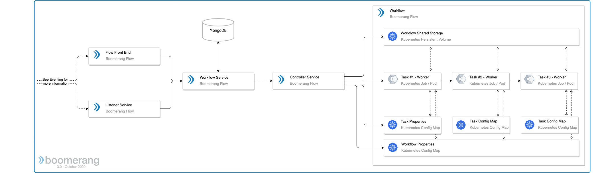
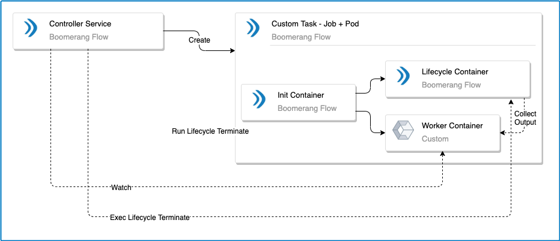

# Architecture overview

The Boomerang Flow application has the following main components.

### Front End application
This is the end user visual designer, enabling no-code workflow building, as well as the ability to see manage all aspects of your workflows, including activity and insights.
### Back End microservice
This component translates the requests from the Front End application and other trigger interactions to an agnostic Directed Acyclic Graph (DAG) model.
### Kubernetes controller
This controller integrates with Kubernetes® to perform and manage executions.
### Task workers
The Task workers are containers used to execute the tasks mapped in the workflow.

## Standard tasks

Standard tasks are prebuilt tasks designed for a no-code experience in Flow. They are single-focus tasks that may offer tight integration into the platform. They have a guaranteed implementation and tested experience.

## Custom tasks

The Custom task is a slightly different implementation than the Standard tasks that come out-of-the-box with Flow. Whereas the Standard tasks have deep integration to the Flow and Controller services, the Custom task has no knowledge or understanding of this. We do not force teams to adhere to a specific implementation.

As such, the Custom task is essentially a bring-your-own container paradigm which Flow then wraps with its own lifecycle implementation via `init-containers` and sidecars.

The Custom task is denoted by a flag in the upper left corner of the task in the workflow Editor and workflow Run pages.

### Init lifecycle

The Init lifecycle is implemented as an init-container and ensures that the prestart requirements are met. This includes creating a lock file and any other dependencies that are needed.

### Watcher lifecycle

The Watcher lifecycle is implemented as a sidecar container. This container waits for the Custom container to complete and then executes the termination activities. This includes setting output properties for the Custom task.

The Watcher and the Custom task containers are linked through a Kubernetes® `emptyDir` mounted to the `/lifecycle` path.

### Controller

The Flow controller will orchestrate this lifecycle in conjunction with ensuring the normal criteria.