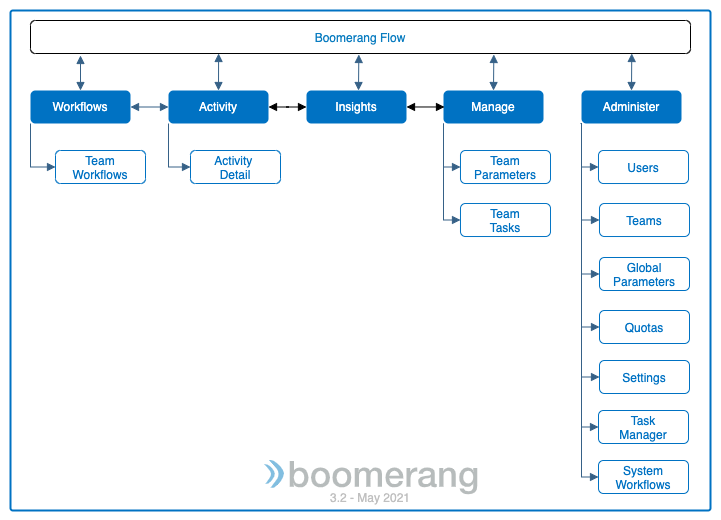

# Navigating

Boomerang Flow provides event driven workflow capabilities and specific controls around managing and administering these workflows.

## Workflows

The centralized landing with workflows by team. From here, you create, edit, and run your workflows.

- **Team Workflows**    
You will see each workflow as a tile within the team. You can view the quotas related to your team and see warnings when breaching a quota allocation.

  Click **View More Quotas** to open a modal and see the quotas set for the team and the current usage against them.

- **Workflow Tile**   
Here you can run a workflow and then in the overflow menu you can edit, view activity, update, export, and delete the workflow.

  Click **Edit** to go to the Workflow Editor and construct your workflow through drag and drop onto a visual editor.
  
## Menu

The menu is the primary navigation tool for Boomerang CICD located to the top left in the header. In addition to providing a means to access the Home page, it presents the following features that support your solution.

- [Workflows](/boomerang-flow/getting-to-know/workflows) - access the per repository components
- [Activity](/boomerang-flow/getting-to-know/activity) - access your pipelines and stages
- [Insights](/boomerang-flow/getting-to-know/insights) - accesses your custom event driven workflows.
- **Manage** - provides ability for teams to set policy templates and team parameters.
- **Administer** - provides ability for Administrators to control component modes, global parameters, SCM repositories, team configuration, task manager and certain CICD settings.

## Supporting Functionality

The following documentation contains information for the usage of Boomerang Flow:

- [Workflow Editor](/boomerang-flow/getting-to-know/editor) - visually draw and edit your workflow and drag and drop tasks from the pallette.
- [Quotas]() - Allocate a team quotas for executing and managing workflows.
