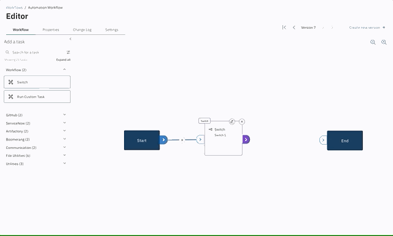

# Customize a Workflow with Editor

Click any Workflow tile to open the Editor page for that Workflow. The editor is where Workflows are created and managed. You define everything to do with your Workflow, including designing the model, triggers, options, and properties.

### Features

- Drag-and-drop
- Dynamic property resolution
- Conditional switches
- Link state logic
- Triggers
- Persistent storage
- Parallelism
- Notes

Here, you define the Workflow using the following data entry properties and attributes. A dynamic graphical user interface is provided for defining the flow.

- **Workflow** - This tab displays an advanced visual drag-and-drop no-code Workflow editor, along with a panel of Tasks to configure in the editor.
  See [Workflow DAG](#Workflow-dag).
- **Properties** - This tab accesses properties that can be defined or updated for the Workflow. See [Workflow Properties](#properties).
- **Configure** - This tab accesses triggers and optional controls that further refine the Workflow.
- **Change Log** - The Change Log displays metrics that give you insight into the history and health of the Workflow.
- **Add a Task** - The controls in this panel allow you to define Tasks that will be called in the Workflow.

## Workflow DAG

The **Workflow** tab accesses the drag-and-drop interface for laying out a Workflow.

You create a Workflow by connecting a series of Tasks laid out left-to-right, with links between the Tasks. These links are what help define the Direct Acyclic Graph (DAG) and associated execution order.

### Links

Links are drawn from the outside node on each Task. Delete actions are also provided for each node.

Standard links have a state feature: Always Run, Success, and Failure. This is a simple but effective way of determining whether the status of a Task is important. You can ask yourself "Is it ok for this Task to fail?" or "Do I want a particular action to occur based on state?". For example, you could have a subsequent Task that raises an alert to be actioned if an important Task fails.

Switch links have no state. Instead, they have a condition value and are shown by a pencil icon. More on this in Switches.

### Task panel

The Task panel is on the left hand side of the interface. This is where you will find all the Tasks, grouped by category, that can be dragged onto a Workflow and initialized.

#### Switches

Switches are a predefined utility, allowing for simple decisions based on the value of the input. When you add a switch, you can simply set a string value or reference a property, as with dynamic switches that are based on inputs at execution time.

Switch links allow for multiple values to be entered, one per line. Only one must match for this connection to be valid. It can be a plain string or regular expression.

Links from switches are unique. These links have a value instead of a state. The link will be set to `default`, meaning the path taken when no others are matched. To set a value on a switch link, click the pencil icon and toggle the default off.

#### Tasks

Tasks are individually executed containers, and as such, can do anything from simple actions to complex integrations.

Each instantiated Task must have a unique name in the Workflow. For example, two Tasks cannot have the same name in the same Workflow and take inputs. The input fields can accept properties such as a previous Tasks output property or a Workflow property.

### Notes

On the right hand side of the screen is a slide out panel for adding Notes to your Workflow. These are tied to your Workflow version and live with your Workflow, allowing you to pass on knowledge. You can enter and style with Markdown, allowing for a rich experience.

## Properties

The **Properties** tab provides the capabilities to create, edit, and delete input properties for the Workflow. Properties can be set for many different parts of the application and are available throughout a Workflow or Task, and are substituted at execution time.

Click **Create a new property** and a modal displays. Input values for the properties you want to define, then click **Create**.

Click any existing property to edit these values at any time. The property is updated for the Workflow in real time.

### Input property syntax and type

Input keys are restricted to numbers, letters and a `.` (period). For example, the following are valid: `valid.key` and `Valid.kEY.123`, however, the following are invalid: `invalid-key` and `invalid&%#key`.

An input property can be of different types and the screen will update dynamically to help you craft the desired values and defaults.

> **Note**: Dependencies are based on trigger type. Properties will render as per their type. When manually executing a Workflow, however, webhook and schedule have particular requirements. Refer to the discussion on triggers in this topic.

| Input Type | Description                                                                      |
| ---------- | -------------------------------------------------------------------------------- |
| Boolean    | Allows for a true / false switch                                                 |
| Number     | Allows for integer input                                                         |
| Password   | A secure input field. _Note: In beta 1 the property will be visible in the logs_ |
| Select     | Defined options that can be selected by the user                                 |
| Text       | Single line text input                                                           |
| Text Area  | Multi-line text input                                                            |

## Configure

The **Configure** tab on the Editor page is where you configure all the general metadata about the Workflow, the triggers, and any advanced options.

### General info

- Identify the owning team of the Workflow.
- Set the unique name of the Workflow.
- Set a summary or short description. _This shows up on the Workflows and execution cards_.
- Enter a description.
- Select from predefined icons.

### Triggers

There are multiple trigger types;

- Manual - always enabled and can be triggered from the Workflows screen.
- Webhook - requires a token to be provided in the payload of the webhook request along with any required inputs.
- Schedule - is based on cron syntax and by specifying a time zone. Any required inputs must have a default value set as this will be used at running time.
- Action Listener - is a NATS stream to subscribe to. You can optionally choose to send data to ACC.

### Other Options

Enable persistent storage for the duration of the Workflow. This allows you to share items between Tasks in the Workflow during execution, as with downloading some files and performing an action on those files.

By enabling persistent storage, you will have a data drive (`/data`). Write the output from a Task to that folder and you will be able to access that file from a subsequent Task.

### Custom Labels

Create pairs of key/value labels to use across our Flow app. These labels doesn't affect the Workflows executions directly, but you can use them for many purposes as integrating with Kubernetes® to define attributes, organizing assets and, on future releases, filter you activities according to them.

You can create as many labels as you want, as long as they follow the rules listed on [Kubernetes Docs](https://kubernetes.io/docs/concepts/overview/working-with-objects/labels/), but to summarize, here are some things you should have in mind.

For Labels:

- They have two segments: the prefix (optional) and name that are separated by a (`/`).
- Prefix must be a DNS subdomain, in other words, could contains dots (`.`) and be no longer than 253 characters.
- Name must begin with alphanumeric characters and can also contain dashes (-), underscores (\_) and dots (.) and be no longer than 63 characters.

For Values:

- Like a label name, must begin with alphanumeric characters and can also contain dashes (-), underscores (\_) and dots (.) and be no longer than 63 characters.

## Change Log and Versioning

Workflows have built-in versioning and Change Log functionality. Every time a user creates a new version of the Workflow, a prompt appears and asks for a comment for **Version**. Versions are viewed in the **Change Log** tab as a record of all changes.

Any version can be rolled back to at any time using the controls on the upper right of the **Design** tab.

### Task Icon Naming Conventions

The icons associated with Tasks in Editor are paired via a key word system displayed in the table below. If the prefix is found at the beginning of the Task name, then the associated Icon in the table will appear with the Task. There are also special cases specified in the table where the prefix can be anywhere in the Task name. If the Task name does not map with any of the listed prefixes, then the default Task icon will be used.

| Prefix    | Needs to be first word | Image Name         | Icon                                               |
| --------- | ---------------------- | ------------------ | -------------------------------------------------- |
| activate  | yes                    | Power              |               |
| appcmd    | yes                    | Terminal           |              |
| approval  | no                     | checkmark--outline |  |
| cancel    | yes                    | close--outline     |        |
| configure | yes                    | filter             |             |
| create    | yes                    | add--outline       |          |
| define    | no                     | edit               |                  |
| deploy    | no                     | launch             |                |
| disable   | yes                    | close--outline     |       |
| download  | no                     | download           |            |
| edit      | no                     | edit               |                    |
| enable    | yes                    | power              |                 |
| export    | yes                    | back-to-top        |           |
| get       | yes                    | search             |                   |
| launch    | yes                    | launch             |                |
| modify    | no                     | edit               |                  |
| read      | no                     | search             |                  |
| register  | yes                    | add-outline        |        |
| shell     | yes                    | terminal           |               |
| start     | yes                    | power              |                  |
| stop      | yes                    | close--outline     |          |
| submit    | yes                    | checkmark--outline |    |
| sync      | yes                    | restart            |                 |
| terminate | yes                    | close--outline     |     |
| update    | yes                    | restart            |               |
| validate  | yes                    | checkmark--outline |  |
| `Default` |                        | predictive         |          |
