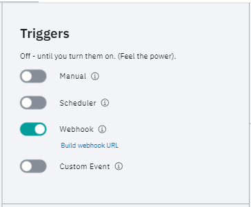

# Triggers & Integrations

Workflows can be triggered in the following ways and these can be configured as part of the **Configure** tab on the Workflow Editor page.

* Manual: allows a workflow to be triggered from the Workflows page.
* Scheduler: allows a workflow to be scheduled with two different formats supported: simple and CRON.
* Webhook: a simple and common API driven integration method.
* Custom Event: a CloudEvent based trigger.


## Tokens

Webhook and Event based triggers require the use of Workflow Tokens. You can make as many tokens as you want and we recommend not using the same token across all your integrations.

## Scheduling  

Workflows can be used executed on a schedule. You can either select the date and time to run the schedule (using the UI controls), or if you are an advanced user, you can specify cron strings to run the Workflows.

### Advanced cron

The advanced cron scheduling accepts both 5 part cron strings as well as 7 part quartz cron syntax

Cron schedule syntax

```
# ┌───────────── minute (0 - 59)
# │ ┌───────────── hour (0 - 23)
# │ │ ┌───────────── day of the month (1 - 31)
# │ │ │ ┌───────────── month (1 - 12)
# │ │ │ │ ┌───────────── day of the week (0 - 6) (Sunday to Saturday;
# │ │ │ │ │                                   7 is also Sunday on some systems)
# │ │ │ │ │
# │ │ │ │ │
# * * * * *
```

| Schedule | Description | Cron | Quartz Cron |
| --- | --- | --- | --- |
| Yearly (or annually) | Run once a year at midnight of 1 January	| `0 0 1 1 *` | `0 0 0 1 1 ? *` |
| Monthly	| Run once a month at midnight of the first day of the month | `0 0 1 * *` | `0 0 0 1 1/1 ? *` |
| Weekly | Run once a week at midnight on Sunday morning | `0 0 * * 0` | `0 0 0 ? * SUN *`
| Daily (or midnight)	| Run once a day at midnight | `0 0 * * *` | `0 0 0 1/1 * ? *` |
| Hourly | Run once an hour at the beginning of the hour | `0 * * * *` | `0 0 0/1 1/1 * ? *` |

To generate Cron schedule expressions, you can use web tools like [crontab.guru](https://https://crontab.guru/). For Quartz Cron expressions you can use web tools like [cronmaker](http://www.cronmaker.com/).

Please note that the `1 1 1 1 1` expression does not work with Flow's scheduling system

## Webhook

Enable the Webhook trigger, then click the **Build webhook URL** link.

You will receive a Workflow-specific access token that can be used to invoke the latest revision of your Workflow programmatically, with the following exposed endpoints.



### Triggering Workflow

**Request** 

POST `http://{flow.service.webhook}/webhook/payload`

```json
{
  "token" : "<Webhook API Token Here>"
}
```

**Response**

After the submission, you will receive an `activityId`. This can be used to request the status of the Workflow execution.

```json
{
  "activityId": "5de81b5fe638b70001fa9d09"
}
```

### Execution Status

**Request**

GET `http://{flow.service.webhook}/webhook/status/{activityId}`

```json
{
  "token" : "<Webhook API Token Here>"
}
```

**Response**

The response for execution status will contain the overall execution status and breakdown of individual Tasks, including the output properties of each Task if they exist.

```json
{
    "creationDate": "2019-12-04T20:47:27.394+0000",
    "duration": 45977,
    "id": "5de81b5fe638b70001fa9d09",
    "status": "completed",
    "WorkflowId": "5dd74d0976df2d000110e52a",
    "WorkflowRevisionid": "5de1d44ee638b70001fa8a13",
    "trigger": "webhook",
    "steps": [
        {
            "activityId": "5de81b5fe638b70001fa9d09",
            "duration": 39130,
            "flowTaskStatus": "completed",
            "id": "5de81b5fe638b70001fa9d0a",
            "order": 1,
            "startTime": "2019-12-04T20:47:27.513+0000",
            "TaskId": "513cde12-4288-4b1d-a79a-51fb23f8e1c0",
            "TaskName": "Run Custom Task 1",
            "outputs": {
                "BMRG_TEST": "Tyson is awesome"
            }
        },
        {
            "activityId": "5de81b5fe638b70001fa9d09",
            "duration": 6669,
            "flowTaskStatus": "completed",
            "id": "5de81b5fe638b70001fa9d0b",
            "order": 2,
            "startTime": "2019-12-04T20:48:06.660+0000",
            "TaskId": "1a4c6b9e-db2e-4149-9603-9957be358138",
            "TaskName": "Sleep 1",
            "outputs": {
                "": ""
            }
        }
    ],
    "teamName": "Tysons Test Team"
}
```

## Custom Events

See the [eventing architecture](/docs/boomerang-flow/architecture/eventing) for more information.
