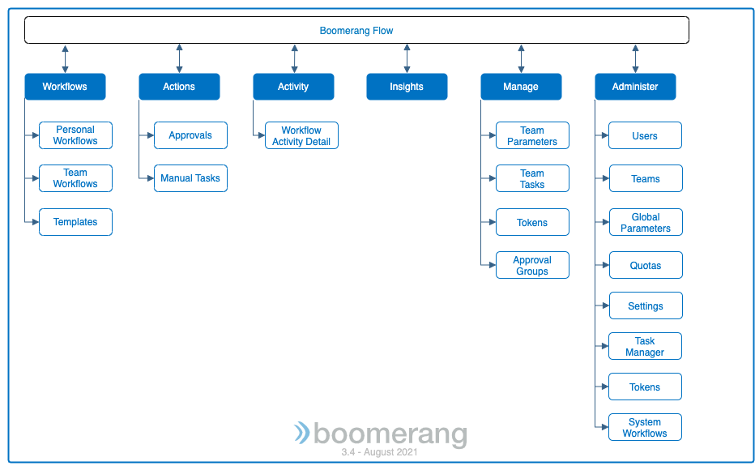

# Overview

Modernize and supercharge your Workflow automation with a powerful no-code event driven Workflow automation tool built cloud native on top of Kubernetes®. It enables new ways of approaching your business Tasks or combine with existing tools to extend your current workloads.

Supporting the no-code paradigm with out-of-the-box Tasks, Boomerang Flow offers extensibility to bring your own Tasks, while providing custom container support. 

Create your next Workflow to produce an end-to-end process that executes a series of Tasks. 

> **Note**: Boomerang Flow is an open source project part of Boomerang-io.

## Benefits

* A no-code drag-and-drop UI editor for creating Workflows.
* Cloud native from the ground up, with no overhead from legacy implementations.
* Cloud agnostic and can be run in any Kubernetes environment.
* Events based on [CloudEvents](https://cloudevents.io) and [NATS](https://nats.io).
* Triggers in any of four easy methods: manual, webhook, schedule, or custom event.
* Parallel processing of Tasks, decisions, dynamic storage, and parameterization. 
* Tasks that are executed as [Kubernetes jobs](https://kubernetes.io/docs/concepts/workloads/controllers/job/).
* Workflow change logs and versioning that provide the ability to roll back to any prior revision.
* Activity detail with per-execution records that detail the executed Workflow and Tasks. Logs, status, and output properties are all available.
* Dynamic insights over time that can be filtered per team, Workflow or a combination thereof.

## What are Tasks and Workflows?

- Tasks are a discrete piece of work .e.g. making a HTTP request. They are the base unit of execution in Flow. 
- Workflows are a series of Tasks connected together.
- Workflows form and are executed as a directed acyclic graph (DAG).

### Tasks

Tasks can be split into three distinct types. See [Getting To Know Tasks](/docs/boomerang-flow/getting-to-know/tasks) for more information.

* System Tasks: are logic based Tasks that influence the DAG.
* Template Tasks: are Tasks that perform a function and can be verified out-of-the box, are community-provided, and managed through Task Manager (in the Admin interface).
* Custom Task: a custom Task allows a bring-your-own container to run in place of a Task and executes any custom logic.

## Wait, what is a DAG again?

- The core concept of Flow. It is how we represent Tasks and their relationships and dependencies that determine how a Workflow executes.
- It's a graph. Think vertices and edges between them.
- It's directed. Edges between vertices have an orientation or direction.
- It's acyclic. You can't end end up where you started in an execution.
- DAGs have a number of applications across a number of disciplines. For our purposes, it is used for scheduling the Tasks in a Workflow.
- Learn some more about [graph theory](https://en.wikipedia.org/wiki/Graph_theory) and [DAGs](https://en.wikipedia.org/wiki/Directed_acyclic_graph) via Wikipedia. 

## Use Cases

There are plenty of ways to use Boomerang Flow, it is all about save people time either by automating repetitive or low value Tasks and increasing your productivity.

* Employee Onboarding - Send, track, and automatically action access requests for new employees
* Git Bot - Manage issue and PR responses and categorizations
* Report Generation - Integrate and collate data from multiple sources into a cohesive scorecard
* Incident Management - Help resolve issues with automatic routing and acknowledgement
* Operations - Implement runbook automation and issue remediation 
* Syncing Systems - Send data between systems as events happen to ensure tools and access stay in sync

## Getting To Know

The following describes the main functionality split and navigation within Boomerang Flow.

- [Workflows](/docs/boomerang-flow/getting-to-know/workflows) - create, view, and manage your personal and team workflows from a centralized location.
- [Activity](/docs/boomerang-flow/getting-to-know/activity) - view the real-time status, logs, outputs, and run times of your workflow activity past and present as well as diving deep into the individual workflows.
- [Actions](/docs/boomerang-flow/getting-to-know/actions) - access your manual actions and respond to needed approvals.
- [Insights](/docs/boomerang-flow/getting-to-know/insights) - view metrics and statistics on Workflow executions over time, showing peak execution periods, average run times, and percentage of success and failures.
- [Schedules](/docs/boomerang-flow/getting-to-know/schedules) - view, create, and manage your Workflow Schedules with a Calendar based view.
- [Manage](/docs/boomerang-flow/getting-to-know/manage) - provides ability for teams to set set team parameters, define team tasks, create API tokens, and define approval groups.
- [Administer](/docs/boomerang-flow/getting-to-know/administer) - provides ability for Administrators to control the instance of Boomerang Flow.

### Supporting Functionality

The following are additional areas of functionality that may be access through the above functional areas or affect them.

- [Workflow Editor](/docs/boomerang-flow/how-to-guide/workflow-editor) - visually draw and edit your Workflow with drag-and drop Tasks from the palette.
- [Quotas](/docs/boomerang-flow/getting-to-know/quotas) - allocate a team quotas for executing and managing Workflows.
- [Parameters](/docs/boomerang-flow/getting-to-know/parameters) - input and output to your Workflow or tasks to help pass information.
- [Triggers](/docs/boomerang-flow/getting-to-know/triggers) - understanding what can cause a Workflow to execute.

### Navigation

The menu is the primary navigation tool for Boomerang Flow. It is located to the top left in the header.

## Sponsored Organizations

### IBM Consulting Essentials

As Boomerang Flow was contributed to open source, and continues to be sponsored by IBM, integration is enabled with IBM Consulting® Essentials. Flow is supported out-of-the box, providing additional enterprise capabilities such as audit logging, consent management, and user and team role management via the broader IBM platform. There are also Tasks available that rely on platform services. 

At installation time, you can configure whether to run Boomerang Flow in standalone mode (default) or integrated to IBM Consulting Essentials.

### Flowabl.io

The team behind Flowabl are some of the original creators of Boomerang Flow and continue to support the Open Source community, as well as providing the [Try Me](https://try.useboomerang.io/flow/apps/flow) environment.

They also provide a free tier of their managed service and benefits for the open source community.