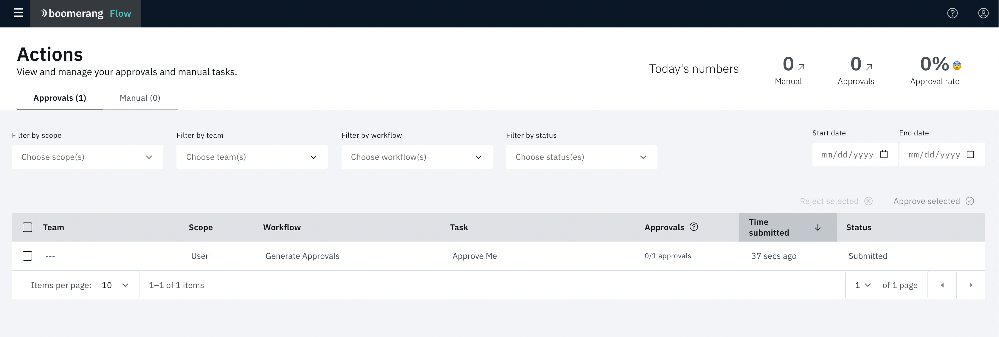

# Actions

The centralized place you go for all Approval and Manual tasks that you need to 'action', think of this as your Action to-do list. It is also a great place to see an audit record of who approved what and when.  Optimising your Approval process, coupled with automation, allows you to cut costs, save time and improve productivity. 

Whilst driving towards fully automated approvals, there are always cases where a manual approval may be needed and are best needed when the automated noise has already been filtered out and you can focus on the Actions that do need the visibility or analysis of a human. For instance:
- To provide sign off/approval for audit purposes such as with quarterly employee reviews.
- Providing sign off/approval before refunds are processed
- Approving new hire onboarding or reviewing their legal paperwork
- Approving vacation requests

The Actions page provides you with a view of Approvals or Manual Tasks and you can filter these by Scope, Team, Workflow, Status, and Dates.

## Approvals

Approvals can be defined as checks that need to occur prior to automation taking place and it means that the Workflow won't move forward until all the necessary approvals are in place.

The Approval will provide you detail of how many approvers are needed and provide a space for any comments that you want to provide.

## Manual Tasks

Manual Tasks are steps that need to be taken by a human. Whilst we strive to acheive full automation, there are always processes that either cannot yet be automated or are truly physical steps that need to take place.

It can also be helpful to use Manual Tasks in your workflow as you are implementing your automation to reflect the tasks that need to take place, and which you can iterate on and replace with automation over time.

The Manual Task will provide you with the detailed steps needing to be completed and provide a space for any comments that you want to provide.

## Activity

Actions on a Workflows Activity will appear in purple as well as show as 'waiting'. You can choose to action this in place on the Activity screen or they can be actioned via the Actions screen. This may need to occur for Actions that require multiple people, such as Approvals that require multiple people to approve.

